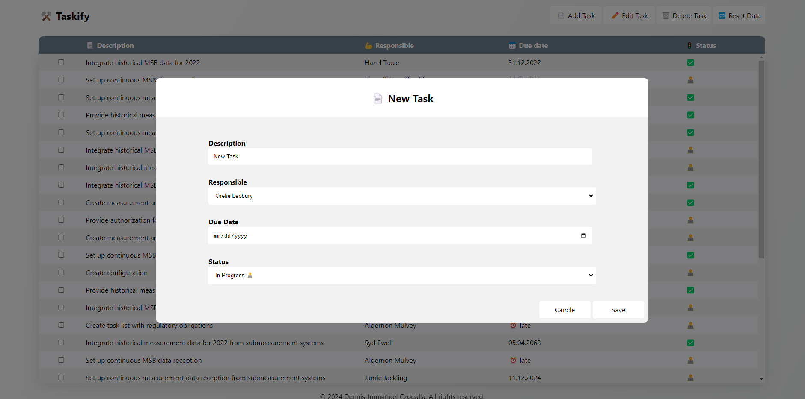

# Taskify 

A project management tool to keep track of ongoing tasks. New Tasks can be created, existing ones can be edited and deleted. Each task is assigned to a specific user and also has a due time.

<p align="center">


</p>

## Server


- ExpressJs
- JSON Server

Run
````
cd server
node server.js
````


The server provides CRUD endpoints and has two routes which return a json based on the request

`http://localhost:3004/todos`
````
GET    /todos
GET    /todos/1
POST   /todos
PUT    /todos/1
PATCH  /todos/1
DELETE /todos/1
````
`http://localhost:3004/persons`
````
GET    /persons
GET    /persons/1
POST   /persons
PUT    /persons/1
PATCH  /persons/1
DELETE /persons/1
````

`http://localhost:3004/reset`
Resets the data to its original state

## Client
- React.js
- Typescript
- CSS

Run
````
cd client
npm start
````

